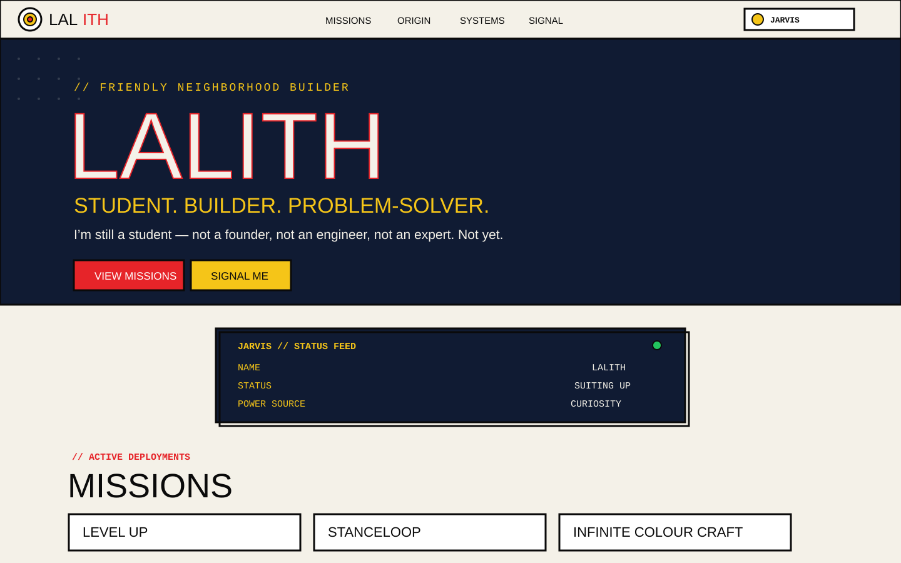

# LALITH — Personal Site

#### This is my porfolio kinda thing for myself, by myself, to myself

[Live Website](https://hustlenix.github.io/-personal-site-/) • [Source](https://github.com/Hustlenix/-personal-site-)


 Current version: this site is plain HTML, CSS and vanilla JavaScript. 


## Key Features

It is basically all about me, so pleae check it out and come

## How It Works

The whole website lives inside the `site/` folder, just open the link and you will get to my site!

### Theme system

Just for my dev friends i have added a light theme and a dark theme, so thay can chage in between 

```html
data-theme="jarvis"
```

to the page and saves the choice in `localStorage`, so the theme is still there when the site is opened again.

### Navigation and animations

The site uses `IntersectionObserver` for two things:

- revealing sections while scrolling
- marking the current navigation link with `aria-current="location"`

The status panel also has a small vanilla-JS typewriter loop for values like:

```text
SUITING UP
BUILDING STUFF
SHIPPING
```

### also check out my other projects:

- [Level Up](https://github.com/Hustlenix/LevelUp)
- [StanceLoop](https://github.com/Hustlenix/stance-loop)
- [Infinite Colour Craft](https://github.com/Hustlenix/Infinite-Colour-Craft)
- [Super-Micro Heroes](https://github.com/Hustlenix/Iron-Mario)
- [AquaGuardian](https://github.com/Hustlenix/aquaguardian)
- this personal site

## Project Structure

```text
-personal-site-/
├── .github/
│   └── workflows/
│       └── deploy.yml
├── site/
│   ├── assets/
│   │   └── site-screenshot.svg
│   ├── 404.html
│   ├── index.html
│   ├── robots.txt
│   ├── script.js
│   ├── sitemap.xml
│   └── styles.css
├── LICENSE
└── README.md
```

## Why I Made It

I wanted a place for my projects that did not look like another copied portfolio template.

I like the Marvel, so I started mixing that with neo-brutalist cards. The main point of the site is show my projects + what i am building and how you can contact me. I also wanted it to be minimal, so made it with just HTML and CSS, slightly used JS

This project uses or is inspired by:
MYSELF!!

## You may also like...

- [Level Up](https://github.com/Hustlenix/LevelUp) — self-improvement app with a persistent companion
- [StanceLoop](https://github.com/Hustlenix/stance-loop) — browser-based pose tracking and training feedback
- [Infinite Colour Craft](https://github.com/Hustlenix/Infinite-Colour-Craft) — colour mixing, painting and local doodle recognition
- [Iron-Mario / Super-Micro Heroes](https://github.com/Hustlenix/Iron-Mario) — fast microgames made in Godot
- [AquaGuardian](https://github.com/Hustlenix/aquaguardian) — ocean-cleaning robot concept site

## License

MIT — see [LICENSE](LICENSE).

---

> [Live Site](https://hustlenix.github.io/-personal-site-/) · GitHub [@Hustlenix](https://github.com/Hustlenix)
